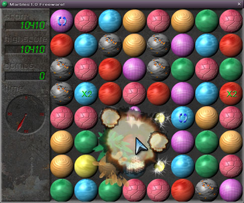



## Marbles 1\.1

### Description

Marbles 1.1 is an DirectX 8.1 puzzle game using FMOD for sound. It features great graphics & graphical effects, great sound effects & MOD music and great gameplay. It Requires DirectX 8.1 and an 3D accelerated grahics card. Using an old verstion of my game engine, PGE, which may be added to Planetsourcecode.com in the future. Make sure you read 'important info.txt'.
 
### More Info
 

             |
---                |---
**Submitted On**   |2003-06-27 17:05:06
**By**             |[Paul Berlin](https://github.com/Planet-Source-Code/PSCIndex/blob/master/ByAuthor/paul-berlin.md)
**Level**          |Advanced
**User Rating**    |5.0 (150 globes from 30 users)
**Compatibility**  |VB 6\.0
**Category**       |[Games](https://github.com/Planet-Source-Code/PSCIndex/blob/master/ByCategory/games__1-38.md)
**World**          |[Visual Basic](https://github.com/Planet-Source-Code/PSCIndex/blob/master/ByWorld/visual-basic.md)
**Archive File**   |[Marbles\_1\_1613307122003\.zip](https://github.com/Planet-Source-Code/paul-berlin-marbles-1-1__1-46840/archive/master.zip)

